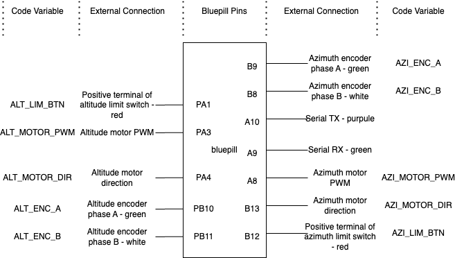

# MotorControl
This repositroy contains all files and code related to controling the motors

## Encoders
We are using a 2 phase rotery encoder. Serial Number - C38S6G5-600B-G24N.
([datasheet](https://www.google.com/search?q=C38S6G5-600B-G24N&rlz=1C5CHFA_enJP1059JP1059&oq=C38S6G5-600B-G24N&gs_lcrp=EgZjaHJvbWUqBggAEEUYOzIGCAAQRRg7MgkIARAAGAoYgAQyBggCEEUYQDIJCAMQABgKGIAEMgYIBBAAGB4yCggFEAAYgAQYogTSAQcxNDZqMGo3qAIAsAIA&sourceid=chrome&ie=UTF-8))
See the following link to understand how they work or ask ChatGPT it gives a good explantion.
[how they work](https://www.dynapar.com/technology/encoder_basics/quadrature_encoder/)

### Important Information
- This encoder requires at least 5V to operate
- It has 600 pulses which means we can use up to 1200 ticks.
- Phases must be pulled up to the VCC supplied to the encoder

### Encoder Connectors
Green = A phase
White = B phase
Red = +Vcc
Black = GND
Shield = The shield should be connected to GND to Reduce the Motor Noice.

## Limit Switched
Limit switched have to be connected with a pullup resistor. 
- Connect the positive terminal (red) of the switch to the bluepill pin. 
- Connected that same pin to one terminal of a resisotr, and the other terminal of the resistor to VCC.
- Connect the negative terminal (purple) of the switch to ground.

## Motor Controllers
To be sure everything is aligned in a consistance way always connected the positive terminal of the motor (red) to terminal B on the controller and the negative terminal (black) to terminal B on the controller.
 ## Connection Pins
All pins connections are documented in the code itself as well.

